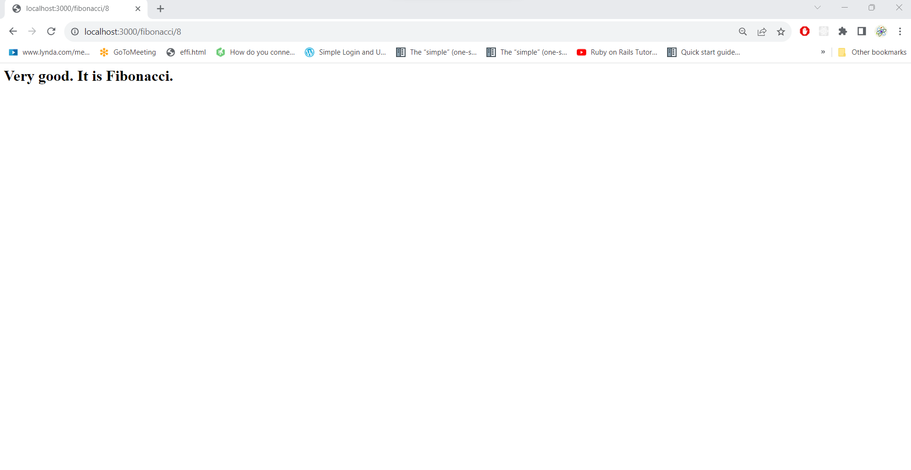
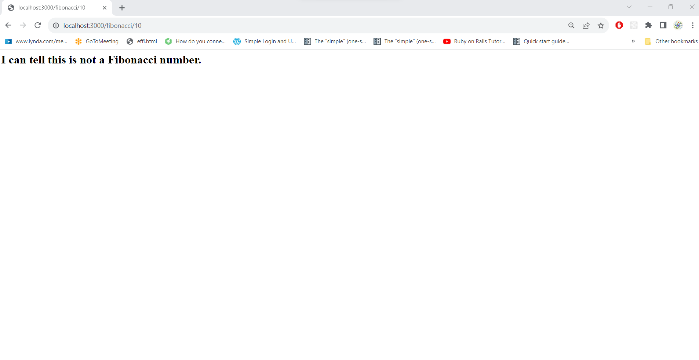

<h1>Fibonnaci Express Application</h1>

<h3>What is the meaning of Fibonacci numbers?</h3>

The Fibonacci sequence is a type series where each number is the sum of the two that precede it. It starts from 0 and 1 usually. The Fibonacci sequence is given by 0, 1, 1, 2, 3, 5, 8, 13, 21, 34, 55, 89, 144, and so on. The numbers in the Fibonacci sequence are also called Fibonacci numbers.

<h2>Requirements</h2>

<ul>
  
<li>Fibonacci</li>

<li>Build an Express app:</li>

<ol>Add Fibonnacias a comment in your application.</ol>
<ol>Create a route 'fibonacci'</ol>
<ol>This route will take one param, the number we will operate on.</ol>
<ol>If the number param is not a fibonacci number, print out "I can tell this is not a fibonacci number."</ol>
<ol>If the number is a Fibonacci number print out "Very good. It is Fibonacci."</ol>
</ul>

<h1>SOLUTION EXPRESS FOR FIBONNACI</h1>

<h2>Approach Used to Solve Fibonnaci</h2>

The server.js file is responsible for starting the Express server and defining the routes. It imports the fibonacciRouter from the fibonacci.js file and mounts it under the /fibonacci path using app.use('/fibonacci', fibonacciRouter).

The fibonacci.js file contains the logic for checking if a number is a Fibonacci number. It defines a router using express.Router() and adds the /fibonacci/:number route. The functionality for checking if a number is a Fibonacci number is implemented in the isPerfectSquare() and isFibonacciNumber() functions.

When you run the server.js file using node server.js, you can access the Fibonacci functionality via the /fibonacci route. For example, visiting http://localhost:3000/fibonacci/8 will yield the response "Very good. It is Fibonacci.", and visiting http://localhost:3000/fibonacci/10 will yield the response "I can tell this is not a Fibonacci number."

